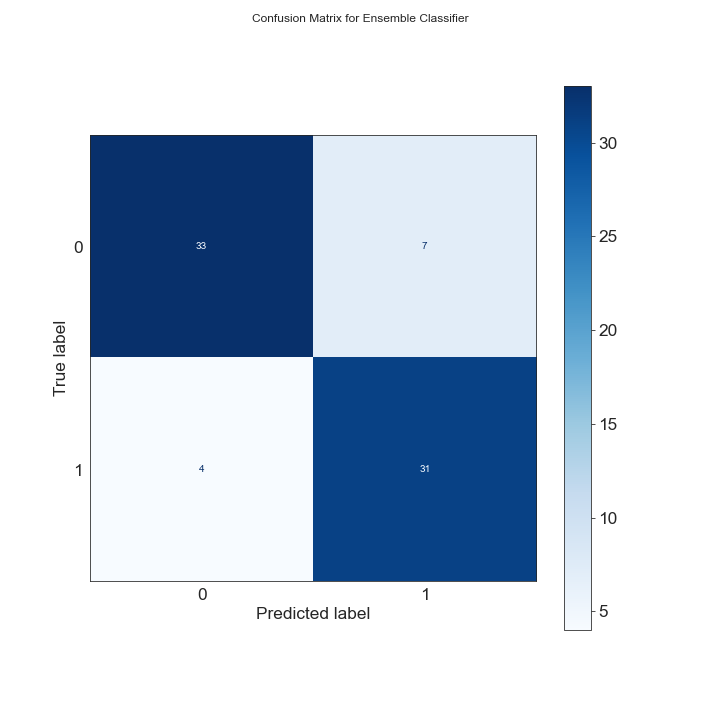

# Predicting Heart Disease

For my third module project for Flatiron School, I chose to build a binary classifier to predict [heart disease](https://www.kaggle.com/danimal/heartdiseaseensembleclassifier). Because this model has healthcare applications, the emphasis is on recall rather than accuracy or precision when evaluating model performance. I explore a variety of relatively simple classifiers (read: no neural networks)––Support Vector Machines, Decision Trees and Random Forests, AdaBoost and XGBoost, KNN––and fine tune each to upwards of 85% recall on test data. My final model, an ensemble [voting classifier](https://scikit-learn.org/stable/modules/generated/sklearn.ensemble.VotingClassifier.html#sklearn.ensemble.VotingClassifier), combines some of the best models to achieve 95% recall on test data.

### EDA and Preprocessing

Of the raw data of 303 patients, 6 had null values in either `ca` or `thal`; for this being so few instances of missing data, those data points were just dropped, making a total of 297 data points.

The original labels, ranging from 0, no heart disease, to 4, the most advanced stage of heart disease, were redesigned to range from `0`, no heart disease, and the original values of [1, 4] were squished into a single category, `1`, "presence of heart disease."

Features were standardized and then analyzed for correlation among each other using a Pearson correlation heatmap. Simultaneously, a random forest was trained to evaluate feature importance, with `thalach`, `cp`, `thal`, and `ca` taking the top four spots.

`thalach` was ranked the most important feature, but looking at the heatmap, it's also the most correlated with the most other features. If I had to pick just one feature, I'd choose this one, but for the sake of choosing multiple features, I'm going to exclude it; none of my other features are so highly correlated with each other. I keep the next six most significant features, none of which are egregiously correlated with each other, for my final set of features: `cp`, `thal`, `ca`, `oldpeak`, `age`, and `chol`. A histogram of each of these final features is shown below, where all continuous features except `oldpeak` are roughly normally distributed about 0.

### Model Training

 
### Results

| Model | Final Test Recall | Final Test Accuracy |
|-|-|-|
| Ensemble Classifier (Soft Vote) | **94%** | 89% |
| Logistic Regression | **89%** | 85% |
| Linear SVC | **89%** | 85% |
| RBF SVC | **89%** | 83% |
| Sigmoid SVC | 86% | 88% |
| Decision Tree | 86% | 85% |
| Random Forest | 86% | 85% |
| AdaBoost | 86% | 84% |
| Polynomial SVC | 86% | 81% |
| XGBoost | 83% | 83% |
| KNN | 83% | 84% |

### Conclusions

## Contents of Repository

* **data**
  * **preprocessed** contains pickled X and y test and train DataFrames of preprocessed data used by all my models.
  * **app_datay.csv** is data used by the app script. It's the original, unprocessed data from Kaggle, albeit with `pred_attribute` converted to either 0, no heart disease, or 1, heart disease for values 1, 2, 3, and 4 in the original data; _minus_ missing data.
  * **Heart_Disease_Data.csv** is original data from Kaggle's [Heart Disease Ensemble Classifier](https://www.kaggle.com/danimal/heartdiseaseensembleclassifier).
* **images** contains all the images used in this README.
* **models** contains all the pickled models made in notebooks 2 and 3. `softvote.pkl` is the soft vote ensemble classifier used by the app for predicting disease from input data (this feature currently in development).
* **notebooks**
  * **1_eda_and_preprocessing.ipynb**
  * **2_sklearn_models.ipynb**
  * **3_ensembl_classifier.ipynb**
* **app.py** is a [Streamlit](https://www.streamlit.io/) app for exploring the raw dataset and interacting with the voting ensemble classifier. (Currently not hosted.)
* **presentation.pdf** contains my powerpoint presentation for a non-technical audience.

## Libraries

The standard packages for data analysis are required–[NumPy](https://numpy.org/), [Pandas](https://pandas.pydata.org/), and [Matplotlib](https://matplotlib.org/)––as well as [pydotplus](https://pypi.org/project/pydotplus/) and [Graphviz](https://graphviz.org/) to make a visualization of a decision tree, [scikit-learn](https://scikit-learn.org/stable/index.html) for a number of classifiers, and [XGBoost](https://xgboost.readthedocs.io/en/latest/).

## Contributing

Due to the nature of the assignment, this project is not open to contributions. If, however, after looking at the project you'd like to give advice to someone new to the field and eager to learn, please reach out to me at [stephen.t.lanier@gmail.com]

## Author

**Stephen Lanier**  
[LinkedIn](https://www.linkedin.com/in/stephen-lanier/) | [GitHub](https://github.com/stlanier) | [Medium](https://stlanier.medium.com/)

## Acknowledgments

Special thanks to Jacob Eli Thomas and Victor Geislinger, my instructors at [Flatiron School](https://flatironschool.com), for their encouragement, instruction, and guidance.

Thanks to [Kaggle](https://www.kaggle.com) for access to data found in [Heart Disease Ensemble Classifier](https://www.kaggle.com/danimal/heartdiseaseensembleclassifier), and particular thanks to [Nathan S. Robinson](https://www.kaggle.com/iamkon/ml-models-performance-on-risk-prediction) for his work on the same dataset: it was beautifully organized, instructive, and a constant source of clarity and inspiration.
