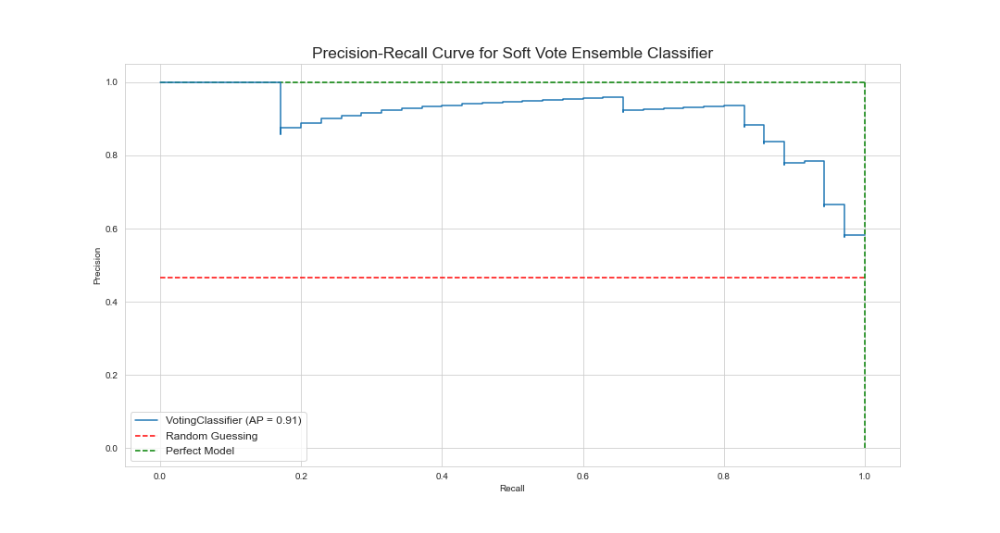
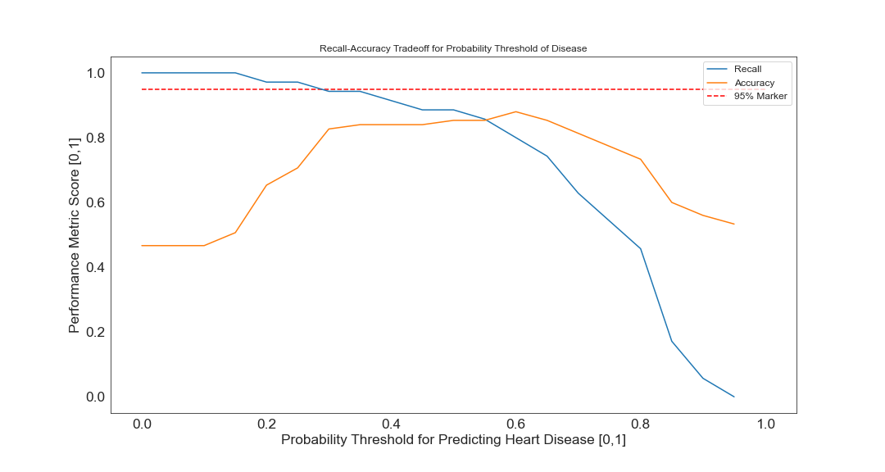

# Predicting Heart Disease

For my third module project for Flatiron School, I chose to build a binary classifier to predict [heart disease](https://www.kaggle.com/danimal/heartdiseaseensembleclassifier). Because this model has healthcare applications, the emphasis is on recall rather than accuracy or precision when evaluating model performance. I explore a variety of relatively simple classifiers (read: no neural networks)––Support Vector Machines, Decision Trees and Random Forests, AdaBoost and XGBoost, KNN––and fine tune each to upwards of 85% recall on test data. My final model, an ensemble [voting classifier](https://scikit-learn.org/stable/modules/generated/sklearn.ensemble.VotingClassifier.html#sklearn.ensemble.VotingClassifier), combines some of the best models to achieve 95% recall on test data.

An interactive app is hosted [here](https://share.streamlit.io/stlanier/heart-disease-classifier/app.py). Currently, you can explore the raw data and soon will be able to interact with the best classifier from this project.

### EDA and Preprocessing

Of the raw data of 303 patients, 6 had null values in either `ca` or `thal`; for this being so few instances of missing data, those data points were just dropped, making a total of 297 data points.

The original labels, ranging from 0, no heart disease, to 4, the most advanced stage of heart disease, were redesigned to range from `0`, no heart disease, and the original values of 1, 2, 3, and 4 were squished into a single category, `1`, "presence of heart disease."

Features were standardized and then analyzed for correlation among each other using a Pearson correlation heatmap. Simultaneously, a random forest was trained to evaluate feature importance, with `thalach`, `cp`, `thal`, and `ca` taking the top four spots.

`thalach` was ranked the most important feature, but looking at the heatmap, it's also the most correlated with the most other features. If I had to pick just one feature, I'd choose this one, but for the sake of choosing multiple features, I exclude it; none of my other features are so highly correlated with each other. I keep the next six most significant features, none of which are egregiously correlated with each other, for my final set of features: `cp`, `thal`, `ca`, `oldpeak`, `age`, and `chol`. A histogram of each of these final features is shown below, where all continuous features except `oldpeak` are roughly normally distributed about 0.

### Model Training

Models were evaluated primarily for their recall, given the healthcare setting, while still trying to maintain modestly high accuracy and precision. Nine models were trained using `GridSearchCV`, including a soft voting ensemble classifier that combined a linear SVM, a logistic regression classifier, and an AdaBoost classifier. Precision recall curves for each are shown below, with a larger, more detailed plot for the voting ensemble classifier below that.

To further improve the voting ensemble classifier's recall, I switched from using the `GridSearchCV` model's predicted output to it's predicted probabilities. From there, I was able to choose a probability threshold for predicting heart disease.

The above figure shows recall vs threshold and accuracy vs threshold plotted together to more easily see the tradeoff between the two; as expected, as recall is increases accuracy generally decreases and vice versa. A happy medium between the two was found at around a 0.35 probability threshold––i.e., if the model predicted a 0.35 chance or higher of heart disease, then the model predicted heart disease––which featured ~0.95 recall while still retaining a relative maximum in accuracy ~0.85. Plotting accuracy-recall tradeoff by threshold in this way yielded significant improvement to model recall, increasing the original recall from 0.89 to 0.94; accuracy decreased only marginally from 0.85 to 0.84. Confusion matrices for before and after threshold installed below.

### Results

| Model | Final Test Recall | Final Test Accuracy |
|-|-|-|
| Ensemble Classifier (Soft Vote) | **94%** | 89% |
| Logistic Regression | **89%** | 85% |
| Linear SVC | **89%** | 85% |
| RBF SVC | **89%** | 83% |
| Sigmoid SVC | 86% | 88% |
| Decision Tree | 86% | 85% |
| Random Forest | 86% | 85% |
| AdaBoost | 86% | 84% |
| Polynomial SVC | 86% | 81% |
| XGBoost | 83% | 83% |
| KNN | 83% | 84% |

### Conclusions

By (1) list-wise removing missing data; (2) converting the classification problem to a binary one and standardizing features; and (3) manually setting the probability threshold for disease detection to 0.35, I was able to achieve **0.95 recall** and **0.89 accuracy** from my best model, a soft voting ensemble classifier made up of a linear SVM, logistic regression classifier, and an AdaBoost classifier.

## App Demo
The app, hosted [here](https://share.streamlit.io/stlanier/heart-disease-classifier/app.py), allows  users to compare the relationship between heart disease and up to three predictors. Future features will allow users to interact with the classifiers used in this project.

## Contents of Repository

* **data**
  * **preprocessed** contains pickled X and y test and train DataFrames of preprocessed data used by all my models.
  * **app_data.csv** is data used by the app script. It's the original, unprocessed data from Kaggle, albeit with `pred_attribute` converted to either 0, no heart disease, or 1, heart disease for values 1, 2, 3, and 4 in the original data; _minus_ missing data.
  * **Heart_Disease_Data.csv** is original data from Kaggle's [Heart Disease Ensemble Classifier](https://www.kaggle.com/danimal/heartdiseaseensembleclassifier).
* **images** contains all the images used in this README.
* **models** contains all the pickled models made in notebooks 2 and 3. `softvote.pkl` is the soft vote ensemble classifier used by the app for predicting disease from input data (this feature currently in development).
* **notebooks**
  * **1_eda_and_preprocessing.ipynb**
  * **2_sklearn_models.ipynb**
  * **3_ensembl_classifier.ipynb**
* **app.py** is a [Streamlit](https://www.streamlit.io/) app for exploring the raw dataset and interacting with the voting ensemble classifier, hosted [here](https://share.streamlit.io/stlanier/heart-disease-classifier/app.py).
* **presentation.pdf** contains my powerpoint presentation for a non-technical audience.
* **requirements.txt** specifies requirements for Streamlit app deployment.

## Libraries

Standard packages for data analysis and visualization are required–[NumPy](https://numpy.org/), [Pandas](https://pandas.pydata.org/), [Matplotlib](https://matplotlib.org/), and [Seaborn](https://seaborn.pydata.org/)––as well as [pydotplus](https://pypi.org/project/pydotplus/) and [Graphviz](https://graphviz.org/) to make a visualization of a decision tree, [scikit-learn](https://scikit-learn.org/stable/index.html) for a number of classifiers, and [XGBoost](https://xgboost.readthedocs.io/en/latest/).

## Contributing

Due to the nature of the assignment, this project is not open to contributions. If, however, after looking at the project you'd like to give advice to someone new to the field and eager to learn, please reach out to me at [stephen.t.lanier@gmail.com]

## Author

**Stephen Lanier**  
[LinkedIn](https://www.linkedin.com/in/stephen-lanier/) | [GitHub](https://github.com/stlanier) | [Medium](https://stlanier.medium.com/)

## Acknowledgments

Special thanks to Jacob Eli Thomas and Victor Geislinger, my instructors at [Flatiron School](https://flatironschool.com), for their encouragement, instruction, and guidance.

Thanks to [Kaggle](https://www.kaggle.com) for access to data found in [Heart Disease Ensemble Classifier](https://www.kaggle.com/danimal/heartdiseaseensembleclassifier), and particular thanks to [Nathan S. Robinson](https://www.kaggle.com/iamkon/ml-models-performance-on-risk-prediction) for his work on the same dataset: it was beautifully organized, instructive, and a constant source of clarity and inspiration.
